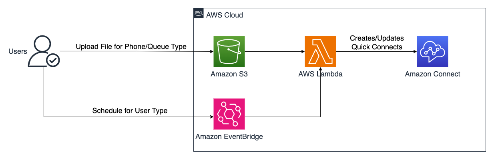

# Amazon Connect Quick Connect as Address Book - Automation

The Amazon Connect - Quick Connects are a way for you to create a list of destinations for common transfers. This Java-based solution automates the creation and management of Quick Connects in Amazon Connect contact centers. It streamlines the process of setting up and maintaining quick connects configurations for agents, phone numbers, and queues.

This solution provides a serverless implementation using AWS Lambda and AWS CDK for infrastructure deployment. It enables contact center administrators to manage Quick Connects through CSV files stored in S3 buckets, supporting three types of Quick Connects: User, PhoneNumber, and Queue. 
This solution automatically associates Quick Connects with all the queues and maintains consistent routing configurations across the contact center environment.

## Architecture



Below are the services that are required for deploying the solution.

* [Amazon Connect](https://docs.aws.amazon.com/connect/latest/adminguide/what-is-amazon-connect.html)
* [AWS Lambda](https://docs.aws.amazon.com/lambda/latest/dg/welcome.html)
* [Amazon S3](https://docs.aws.amazon.com/AmazonS3/latest/userguide/Welcome.html)
* [Amazon EventBridge](https://docs.aws.amazon.com/eventbridge/latest/userguide/what-is-amazon-eventbridge.html)

## Pre-requisites

Before getting started, make sure you have the following:

- AWS Account
- Amazon Connect Instance
- Java Development Kit (JDK) installed on your local machine
  - Java 21 or later. If missing install Amazon Corretto Java 21 from [here](https://docs.aws.amazon.com/corretto/latest/corretto-21-ug/what-is-corretto-21.html).
    ```shell
    java --version
    ```

  - Maven 3.9 or later. If missing install Maven from [here](https://maven.apache.org/download.cgi).
  - Note: Java version showed in the below output should be 21 or later.
    ```shell
    mvn --version
    ```

- AWS CLI configured with valid credentials
  - AWS CLI. If missing install latest AWS CLI from [here](https://docs.aws.amazon.com/cli/latest/userguide/install-cliv2.html).
    ```shell
    aws --version
    ```
- Node.js and npm installed (required for CDK)
  - Node.js 22.x or later. If missing install Node.js from [here](https://nodejs.org/en/download/).
    ```shell
    node --version
    ```

- AWS CDK - Install the latest [AWS CDK Toolkit](https://docs.aws.amazon.com/cdk/v2/guide/cli.html) globally using the following command:
    ```shell
    npm install -g aws-cdk
    ```
    ```shell
    cdk --version
    ```
  - CDK Bootstrap - Bootstrap your AWS account for CDK. This only needs to be done once per account/region.
    ```shell
    cdk bootstrap aws://<account>/<region>
    ```


## Installation

Clone the repository:
```bash
git clone <repository-url>
cd sample-amazon-connect-quick-connect-addressbook
```

Build the project:
```bash
mvn clean install
```

Configure these values before deploying the infrastructure; Update the file [cdk.context.json](./Infra/cdk.context.json) with your values.
<br> Note: ProcessQuickConnectType - All (default), User, Phone or Queue 
  ```json
    {
      "InstanceId": "<AmazonConnectInstanceId>",
      "DefaultAgentTransferFlowId": "<DefaultAgentTransferFlowId>",
      "ProcessQuickConnectType": "All"
    }
  ```

Deploy the infrastructure:
```bash
cd Infra
cdk deploy
```

## Verify
Make sure you are in the right AWS account and region.

[AWS CloudFormation](https://us-west-2.console.aws.amazon.com/cloudformation/home) will create similar to below resources
<br> Note: Not all the resources are shown in the screenshot below.


## Quick Start
1. Prepare your Quick Connect CSV file following the sample format:
Note: 
   1. You need the below CSV file only for PhoneNumber and Queue Type (quickConnectType).
   2. User Type will be created and managed using the user information available in the Amazon Connect User Management. 
```csv
quickConnectName,quickConnectType,destinationId,contactFlowId,description
quick-connect-1,Phone,+11234567890,,PhoneNumberTransfer
quick-connect-2,Queue,5b210f8d-6e0a-490f-9264-28c2b809df51,9dba5adb-b389-4a6a-9ef2-d42ea9ef3693,QueueTransfer
```
  - quickConnectName -> Name for the QuickConnect.
  - quickConnectType -> Phone or Queue.
  - destinationId -> 
    - When quickConnectType is Phone -> destinationId is PhoneNumber in E.164 format.
    - When quickConnectType is Queue -> destinationId is QueueID.
  - contactFlowId -> Required only for quickConnectType = Queue, its Queue Transfer Contact Flow Id.
  - description -> Description of QuickConnect.

2. Upload the CSV file to the configured S3 bucket to trigger the Quick Connect creation process.


## Cleanup

Run the below command to delete the application.
```shell
cdk destroy
```
This will delete all the provisioned resources from your AWS account.
